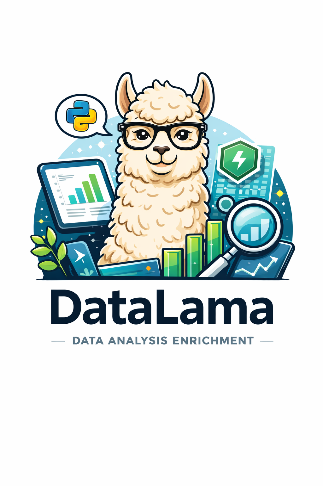

# DataLens

A microservice that takes data in several formats and returns a forecast or a summary of the data.
Runs Python with FastAPI and uses LangChain to analyse the given data through a chosen LLM provider.



## API Endpoints

| Method | Path           | Description                    |
| ------ |----------------| ------------------------------ |
| GET    | `/health`      | Health check                   |
| POST   | `/forecasting` | Time series forecasting        |
| POST   | `/summary`     | Generate a summary of the data |
| POST   | `/anomaly`     | Detect anomalies in the data   |
| POST   | `/pattern`     | Recognize patterns in the data |
| POST   | `/comparison`  | Compare datasets               |

All endpoints except `/health` require an API key passed via the header configured in `API_KEY_FIELD_NAME` (default: `X-API-Key`).

## Configuration

The service is configured via environment variables:

| Variable                 | Default             | Description                                          |
| ------------------------ |---------------------|------------------------------------------------------|
| `MODEL`                  | `claude-sonnet-4-6` | LangChain model identifier (e.g. `anthropic/claude-sonnet-4-5-20250514`) |
| `LLM_PROVIDER_API_TOKEN` | —                   | API token for the LLM provider                       |
| `API_KEY`                | —                   | API key for authenticating requests                  |
| `API_KEY_FIELD_NAME`     | `X-API-Key`         | Header name used to pass the API key                 |
| `HOST`                   | `0.0.0.0`           | Host the server binds to                             |
| `PORT`                   | `3000`              | Port the server listens on                           |
| `DEBUG`                  | `false`             | Enable debug mode (no authentication needed)         |

The model name has to follow the [LangChain's model name schema](https://docs.langchain.com/oss/python/langchain/models)

### LangSmith Tracing (Optional)

DataLens supports [LangSmith](https://smith.langchain.com/) for tracing and observability of LLM calls. To enable it, set the following environment variables:

| Variable              | Default | Description                                              |
| --------------------- |---------| -------------------------------------------------------- |
| `LANGSMITH_TRACING`   | false   | Set to `true` to enable LangSmith tracing                |
| `LANGSMITH_API_KEY`   | —       | Your LangSmith API key                                   |
| `LANGSMITH_PROJECT`   | —       | LangSmith project name to group traces under             |
| `LANGSMITH_ENDPOINT`  | —       | LangSmith API endpoint (optional, for self-hosted setups)|

When enabled, all LLM analysis requests are traced via the `@traceable` decorator and visible in your LangSmith dashboard.

### Knowledge Base (Optional)

DataLens can enrich analyses with data pulled from your own knowledge sources. The following providers are supported:

- **GitHub**
- **Slack**
- **Jira**
- **Confluence**

To enable it, set the following environment variables:

| Variable                     | Default                          | Description                                                |
| ---------------------------- | -------------------------------- | ---------------------------------------------------------- |
| `KNOWLEDGE_BASE_ENABLED`     | `false`                          | Set to `true` to enable knowledge base ingestion           |
| `KNOWLEDGE_BASE_CONFIG_PATH` | `/app/config/knowledge_bases.yml`| Path to the knowledge base config file inside the container |

When enabled, the service reads provider definitions and credentials from the YAML file at `KNOWLEDGE_BASE_CONFIG_PATH` and periodically fetches data from each configured provider.

The config file follows this format:

```yaml
knowledge_bases:
  - provider: slack
    token: xoxb-...
    channel_ids: ["C123", "C456"]
```

Mount the file into the running environment (e.g. via a Docker volume or a Kubernetes Secret/ConfigMap) so the path matches `KNOWLEDGE_BASE_CONFIG_PATH`.

## Helm Chart

The chart is published to GHCR and can be used to deploy DataLens to a Kubernetes cluster.

The chart includes:
- **Traefik** as a reverse proxy with an optional authenticated dashboard
- **Redis** for rate limiting — `REDIS_HOST`, `REDIS_PORT`, and `REDIS_PASSWORD` are automatically injected into all pods
- **HPA** for autoscaling based on CPU and memory utilization

### Installation

```bash
helm install datalens oci://ghcr.io/schmenniooo/helm/datalens-chart
```

### Configuration

All environment variables can be set via `environmentVariables` in your `values.yaml`:

```yaml
environmentVariables:
  - name: MODEL
    value: "anthropic/claude-sonnet-4-5-20250514"
  - name: LLM_PROVIDER_API_TOKEN
    value: "your-llm-provider-token"
  - name: API_KEY
    value: "your-api-key"
  - name: API_KEY_FIELD_NAME
    value: "X-API-Key"
  # Optional: LangSmith tracing
  - name: LANGSMITH_TRACING
    value: "false"
  - name: LANGSMITH_API_KEY
    value: "your-langsmith-api-key"
  - name: LANGSMITH_PROJECT
    value: "your-langsmith-project"
```

### Values

| Key                                        | Default                        | Description                                              |
| ------------------------------------------ | ------------------------------ | -------------------------------------------------------- |
| `replicaCount`                             | `1`                            | Number of pod replicas (ignored when autoscaling enabled) |
| `service.type`                             | `ClusterIP`                    | Kubernetes service type                                  |
| `service.port`                             | `3000`                         | Service port                                             |
| `resources.requests.cpu`                   | `100m`                         | CPU request                                              |
| `resources.requests.memory`                | `64Mi`                         | Memory request                                           |
| `resources.limits.cpu`                     | `500m`                         | CPU limit                                                |
| `resources.limits.memory`                  | `128Mi`                        | Memory limit                                             |
| `autoscaling.enabled`                      | `true`                         | Enable Horizontal Pod Autoscaler                         |
| `autoscaling.minReplicas`                  | `1`                            | Minimum number of replicas                               |
| `autoscaling.maxReplicas`                  | `10`                           | Maximum number of replicas                               |
| `autoscaling.targetCPUUtilizationPercentage` | `75`                         | Target CPU utilization for scaling                       |
| `autoscaling.targetMemoryUtilizationPercentage` | `75`                      | Target memory utilization for scaling                    |
| `dashboard.enabled`                        | `true`                         | Enable Traefik dashboard                                 |
| `dashboard.host`                           | `dashboard.docker.localhost`   | Hostname for the dashboard IngressRoute                  |
| `dashboard.auth.username`                  | `admin`                        | Dashboard BasicAuth username                             |
| `dashboard.auth.password`                  | `changeme`                     | Dashboard BasicAuth password                             |
| `dashboard.tls.enabled`                    | `false`                        | Enable TLS for the dashboard                             |
| `dashboard.tls.secretName`                 | `""`                           | Name of the k8s Secret containing `tls.crt` and `tls.key` |
| `redis.auth.enabled`                       | `true`                         | Enable Redis authentication                              |
| `redis.auth.password`                      | `changeme`                     | Redis password (also sets `REDIS_PASSWORD` in pods)      |
